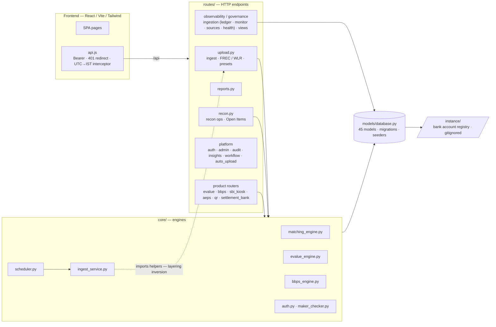
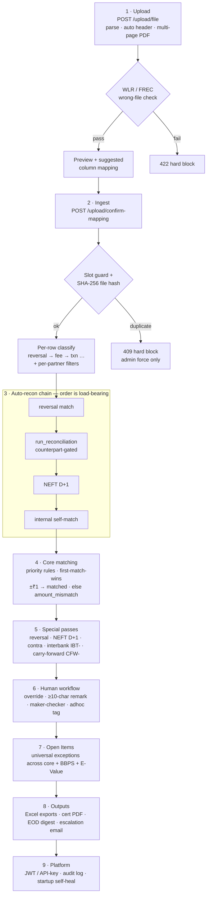
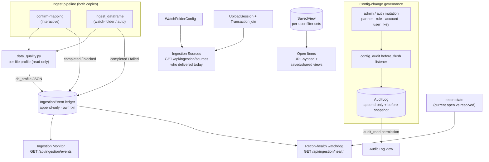

# Architecture

How Eko Recon is put together, end to end. Read this before touching anything in
`backend/core/` or `backend/routes/upload.py`.

## Stack & topology

- **Backend** — FastAPI monolith ([backend/main.py](../backend/main.py)), SQLAlchemy over
  SQLite by default (`DATABASE_URL` switches to MySQL/PostgreSQL), APScheduler
  (Asia/Kolkata timezone) for cron work. In production the backend serves the built React
  app from `frontend/dist`.
- **Frontend** — React 18 / Vite / Tailwind SPA. One axios instance
  ([frontend/src/utils/api.js](../frontend/src/utils/api.js)) with baseURL `/api`, Bearer-token
  injection, a global 401 → `/login` redirect, and a **global response interceptor that
  rewrites every datetime-shaped string from UTC to IST** for display. Pages contain no
  timezone logic of their own.
- **Layers**
  - `backend/routes/` — HTTP endpoints. `upload.py` (ingestion pipeline + format presets +
    FREC/WLR checks), `recon.py` (recon operations + Open Items), `reports.py`, product
    routers (`evalue.py`, `bbps.py`, `sbi_kiosk.py`, `aeps_settlement.py`, `qr_settlement.py`,
    `settlement_bank.py`), platform (`auth.py`, `admin.py`, `audit.py`, `insights.py`,
    `workflow.py`, `auto_upload.py`, `recon_jobs.py`, `report_subscriptions.py`),
    observability/governance (`ingestion.py` — ledger / monitor / sources / health,
    `views.py` — saved views).
  - `backend/core/` — engines: `matching_engine.py` (rule-based matcher + special passes),
    `evalue_engine.py` (8 bank-statement parsers + 5-pass matcher), `bbps_engine.py`,
    `ingest_service.py` (the watch-folder copy of the ingest pipeline), `scheduler.py`,
    `notifications.py`, `report_scheduler.py`, `auth.py` (JWT + API keys), `maker_checker.py`,
    `jobs.py` (in-process job pool), `file_hash_guard.py` (SHA-256 duplicate-file guard),
    `pdf_converter.py` (Excel/CSV/PDF → DataFrame), and the additive governance/observability
    helpers: `config_audit.py` (config-change audit listener), `ingestion_ledger.py`,
    `data_quality.py`, `ingestion_sources.py`, `recon_health.py`.
  - `backend/models/database.py` — all 45 models, hand-rolled idempotent migrations, and
    seed functions that run on **every startup**.
  - `backend/instance/` — deployment-specific data (bank account registry), gitignored.

> **Known wart**: `core/ingest_service.py` and `core/scheduler.py` import helpers from
> `routes/upload.py` (layering inversion), and the ingest pipeline exists in two slightly
> divergent copies (interactive upload vs watch-folder). Fix only with characterization
> tests in place — see [behavior-contract.md](behavior-contract.md).

## End-to-end data flow

1. **Upload** — `POST /api/upload/file`: parse file (auto header detection, multi-page PDF),
   run WLR wrong-file detection (422 hard-block) and FREC format check, auto-detect column
   mapping from `BANK_FORMAT_PRESETS` (first-subset-match-wins), return preview + suggested
   mapping.
2. **Ingest** — `POST /api/upload/confirm-mapping`: 409 hard-block on re-upload of an
   existing partner/side/date slot unless an admin passes `force=true`; per-row
   classification (`txn` / `reversal` / `fee_reversal` / `fee_charge` / `fund_transfer` /
   `settlement_credit` — reversal is checked **before** fee, deliberately); TID/tracking/UTR
   extraction from bank narration via an order-sensitive regex ladder; per-partner filters
   (e.g. Fino `ACCOUNT_ACTION_ID==118` drop, Levin `EKOI` prefix strip, Digikhata eKYC
   auto-close); mixed dumps fan out per-row to partners via `SOURCE_PARTNER_MAP`.
3. **Auto-recon chain** (in this order, each error swallowed): reversal match →
   bidirectional `run_reconciliation` (only when the counterpart side has data) →
   NEFT D+1 → internal self-match.
4. **Core matching** — per (partner, recon_date): priority-ordered field rules (DB
   `MatchRule` rows, falling back to `DEFAULT_RULES`), first-match-wins. Amount within ₹1 →
   `matched`, else `amount_mismatch`. Leftover rows whose TID/tracking already matched are
   flagged `duplicate`. Match IDs are `{PREFIX}-{YYYYMMDD}-{NNNN}` with MAX+1 sequencing,
   serialized by a process-local lock (single-worker assumption).
5. **Special passes** — NEFT D+1 (yesterday's bank UTR vs today's internal), bank↔bank
   reversal pairing (partner-specific narration patterns, cross-date), internal
   Success+Refund / DR-CR contra netting, cross-bank interbank CR↔DR UTR pairing (`IBT-`
   IDs), configurable D+N carry-forward (`CFW-` IDs).
6. **Human workflow** — override / bulk-override / unmatch / rematch / tag-adhoc / manual
   interbank all require a ≥10-char remark, snapshot `prev_recon_status`, and write
   `action_type='human'` audit rows. With maker-checker enabled, non-admin actions queue as
   `ApprovalRequest` rows; approval replays the stored JSON payload through the original
   handler as the approver; self-approval is blocked.
7. **Open Items** — the universal exceptions window: unions the core `transactions` ledger
   with the BBPS and E-Value module tables through status-bucket adapters; partner `dmt`
   fans out to the DMT partners; "All partners" stitches SQL pagination with module-row
   offsets.
8. **Outputs** — styled Excel exports (open items, summary, ageing, SRC, matched pairs, EOD
   3-sheet, audit), reconciliation certificate PDF, escalation email drafts, PG
   net-settlement summary, scheduled per-user report emails, daily EOD digest.
9. **Platform** — JWT (8h) or hashed `X-API-Key` (optional IP/CIDR allowlist); permission
   JSON + `allowed_products` gating; append-only audit log; startup self-healing
   (create_all, idempotent ALTER TABLEs, match-ID repair + backfill, seeders).

## Product modules

| Module | Ingest | Matching |
|---|---|---|
| **DMT** (multi-partner) | Core upload: bank statements + internal dump (mixed dumps auto-split per partner) | Rule engine + reversal / NEFT D+1 / internal / interbank passes |
| **AePS** | Core upload + settlement reports (T-Plus / Anomaly / CIB) | Core rules; settlement formula `Settlement = Txn − Anomaly − 2FA − CIB` (±0.02); AS=SD cross-file integrity check |
| **PG** | Core upload with net_amount | TID+Amount rule; per-file net-amount check (±₹1) |
| **QR** | Core upload + settlement reports | Core rules; `Net = Amount − Fees − FeesTax − Early − EarlyTax` (±0.05); manual chargebacks |
| **E-Value** (wallet loads, 8 banks) | Dedicated upload: internal dump upserts by TID; bank statement **replaces** prior rows per account | 5 passes: reference → fuzzy UTR → cash scoring → twice-credit → fee/debit; global cross-account reference pass |
| **BBPS** | Dedicated upload, provider auto-detect | `eko_trxn_id == ClientRef`; refund lifecycle (`failed_pending_refund`, `refunded_but_success`) |
| **SBI Kiosk** | 6 upload endpoints (tab-separated `.xls` statement, narration keyword parsing) | P01–P04 algorithms, scoped to rows uploaded today |

## Observability & governance (additive layer)

A read-only governance/observability layer added on top of the live engine — new tables
(nullable), new read-only endpoints, and opt-in surfaces only. It never participates in
matching and cannot change a reconciliation outcome.

- **Ingestion ledger → Monitor / Sources / Health.** Both ingest copies record an
  `IngestionEvent` (file fingerprint, row counts, WLR/FREC outcome, duration) in a separate
  transaction; the data-quality profiler attaches a read-only per-file profile. The ledger
  powers the Ingestion Monitor, the "who delivered today" Sources catalog, and the
  recon-health watchdog. The health view reads **current** `Transaction` state for the
  reconciliation rate (not `ReconRun` logs, which miss D+1/reversal matches).
- **Config-change governance.** A `before_flush` listener writes an append-only `AuditLog`
  row with a before-snapshot for every admin/auth config mutation; reading the audit log
  requires the `audit_read` permission.
- **Saved views.** Open Items filters round-trip through the URL (shareable) and a per-user
  `SavedView` store; a view is just a stored filter set replayed through the unchanged
  Open-Items endpoint (behavior-contract #14).

## Design invariants

These are deliberate, not accidents — see [behavior-contract.md](behavior-contract.md) for
the full list with file/line references:

- **Timestamps**: backend stores naive UTC; the frontend interceptor renders IST; Excel
  exports convert server-side. Never make them tz-aware.
- **Amounts**: floats with per-engine tolerances (₹1 core, exact E-Value, 0.02 AePS,
  0.05 QR). The tolerances differ on purpose.
- **Business dates**: zero-padded strings compared lexicographically.
- **Match IDs**: audit references — formats and sequencing must never change retroactively.
- **Seeds run every startup** and double as data migrations; idempotency keys are exact
  string matches.
